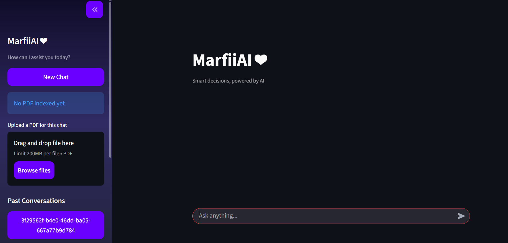
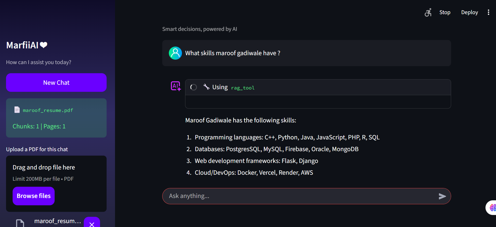

# 🧠🤖 MarfiiAI – Agentic AI Assistant

**MarfiiAI** is an **Agentic AI–powered chatbot** built using **LangGraph** that intelligently **routes user queries across multiple tools**, including Web Search, Weather, and RAG (Retrieval-Augmented Generation). It features a **Streamlit-based interactive user interface, real-time streaming responses, and persistent conversational memory** to enable coherent, context-aware interactions across multiple turns.

---
## 📌 Preview

<p align="center">
  
</p>
<p align="center">
  
</p>

---
## 🚀 Key Features

- 🧠 **Agentic Architecture (LangGraph)**
  - Dynamic decision-making for tool usage
  - State-based execution flow

- 📚 **RAG (Retrieval-Augmented Generation)**
  - Query-aware document retrieval
  - Context-aware, grounded responses

- 🔎 **Web Search Tool**
  - Fetches real-time information from the web

- 🌦️ **Weather Tool**
  - Provides current weather information based on location

- 🔁 **Streaming Responses**
  - Token-by-token response streaming for better UX

- 💾 **Persistency**
  - Stores chat history and conversation state
  - Enables long-running contextual conversations

- 🖥️ **Streamlit Interface**
  - Clean and simple frontend
  - Real-time interactions with backend agents

---

## 🏗️ Tech Stack

| Layer | Technology |
|------|-----------|
| Agent Framework | LangGraph |
| LLM Used | ChatGroq |
| Frontend | Streamlit |
| Backend | Python |
| Vector Store | FAISS |
| Database | SQLite (for persistence) |
| APIs | Web Search, Weather APIs |

---

## 📂 Project Structure
```
MarfiiAI-agentic-chatbot/
  │── images/                 # Images for the chatbot
  │── backend.py              # Workflow Definition and Persistency
  │── frontend.py             # Streamlit Frontent
  │── requirements.txt        # Requirements file for the chatbot
  │── chatbot.db              # This file gets created automatically 
```

---

## 🔧 How to Run
```bash
# Clone the repository
git clone https://github.com/maroofgadiwale/MarfiiAI-agentic-chatbot.git

# Navigate into the project directory
cd MarfiiAI-agentic-chatbot

# (Optional) Create & activate virtual environment
python -m venv venv
venv\Scripts\activate    # Windows
# source venv/bin/activate  # macOS / Linux

# Install dependencies
pip install -r requirements.txt

# Run the Streamlit app
streamlit run frontend.py
```
---

## 🤝 Developer

* **Maroof Gadiwale** – IT Student | Aspiring Data Scientist | ML Engineer ❤️

---
<p align="center">
🟡 Built using Agentic AI and LangGraph for intelligent, tool-driven conversations 🟡
</p>
<p align="center">
✨ Feel free to use! ✨
</p>

